Forecasting Basics
================
Pawan Kumar
02/06/2021

``` r
knitr::opts_chunk$set(echo = TRUE, warning = FALSE, message = FALSE)
```

# Introduction

For time series data, the obvious graph to start with is a time plot.
That is, the observations are plotted against the time of observation,
with consecutive observations joined by straight lines. Figure below
shows the weekly economy passenger load on Ansett Airlines between
Australias two largest cities.

## Time Series Plot

``` r
library(fpp2) 
autoplot(melsyd[,"Economy.Class"]) + ggtitle("Economy class passengers: Melbourne-Sydney") + xlab("Year") + ylab("Thousands")
```

<!-- -->

## Seasonal Plot

``` r
ggseasonplot(a10, year.labels=TRUE, year.labels.left=TRUE) + ylab("$ million") + ggtitle("Seasonal plot: antidiabetic drug sales")
```

<!-- -->

## Polar seasonal plot

``` r
ggseasonplot(a10, polar=TRUE) + ylab("$ million") + ggtitle("Polar seasonal plot: antidiabetic drug sales")
```

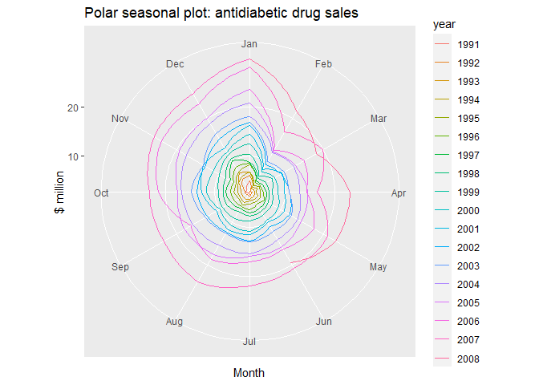<!-- -->

## Seasonal subseries plot

``` r
ggsubseriesplot(a10) + ylab("$ million") + ggtitle("Seasonal subseries plot: antidiabetic drug sales")
```

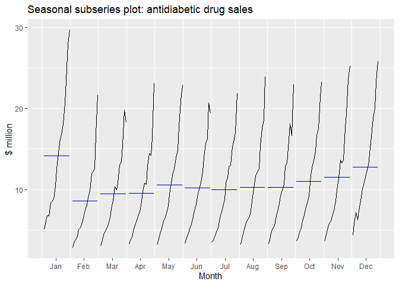<!-- -->

**Figure 2.6:** Seasonal subseries plot of monthly antidiabetic drug
sales in Australia.

The horizontal lines indicate the means for each month. This form of
plot enables the underlying seasonal pattern to be seen clearly, and
also shows the changes in seasonality over time. It is especially useful
in identifying changes within particular seasons.

## Visualizing relationship between time series

``` r
autoplot(elecdemand[,c("Demand","Temperature")], facets=TRUE) + xlab("Year: 2014") + ylab("") + ggtitle("Half-hourly electricity demand: Victoria, Australia")
```

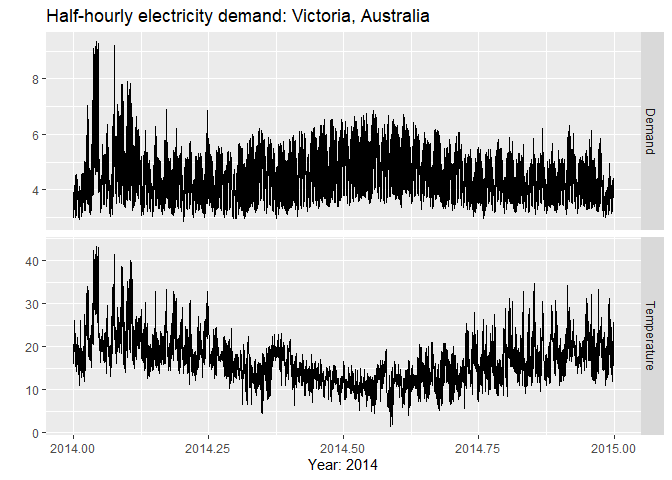<!-- -->

## Scatter plot between Temperature and Demand

``` r
# use of qplot - takes only dataframe

qplot(Temperature, Demand, data = as.data.frame(elecdemand)) + ylab("Demand") + xlab("Celsius")
```

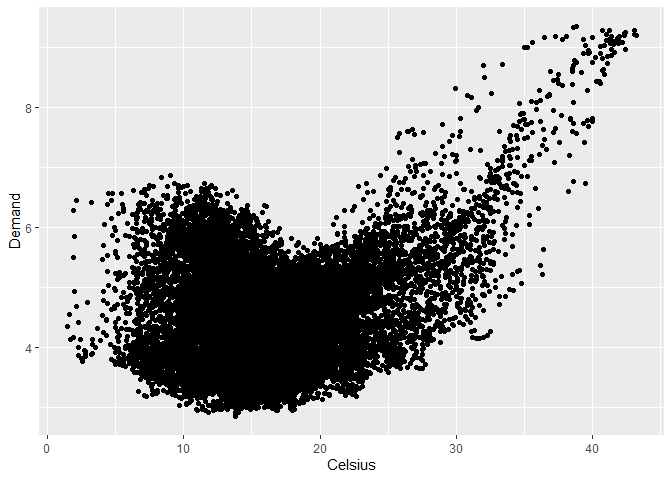<!-- -->

## Correlation coefficients

Note: The correlation coefficient only measures the strength of the
linear relationship,and can sometimes be misleading. In some cases
non-linear relationship is much stronger than linear

Multiple plots at with common x-axis and y-axis

``` r
 autoplot(visnights[,1:5],facets = TRUE ) + ylab("Number of visitor nights each quarter (millions)")
```

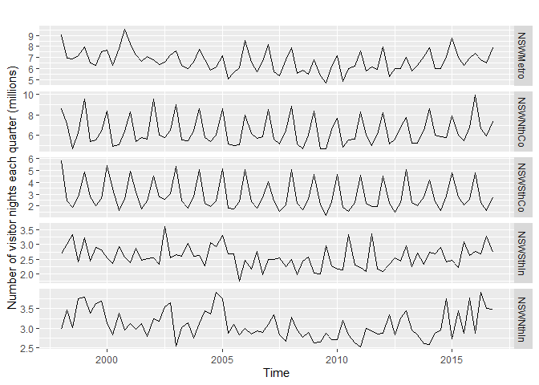<!-- -->

## Scatterplot Mattrices

When there are several potential predictor variables, it is useful to
plot each variable against each other variable.

``` r
library(GGally) 
GGally::ggpairs(as.data.frame(visnights[,1:5]))
```

<!-- -->

## Lag Plot

``` r
# use of window to extract a subset of a time-series
beer2 <- window(ausbeer, start = 1992)
gglagplot(beer2)
```

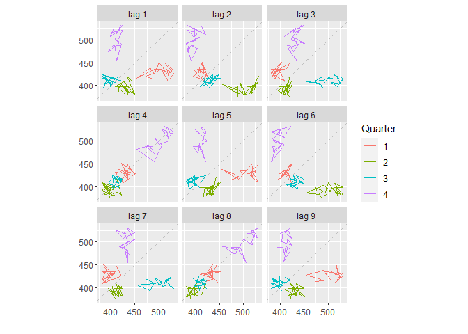<!-- -->

Horizontal axis shows the lagged values *y*<sub>*t* − *k*</sub> with
*y*<sub>*t*</sub> for different values of k

## Correlogram

Autocorrelation measures the correlation between the lagged values of a
time series. Correlogram is a plot of autocorrelation function ACF
between lagged values.

``` r
ggAcf(beer2)
```

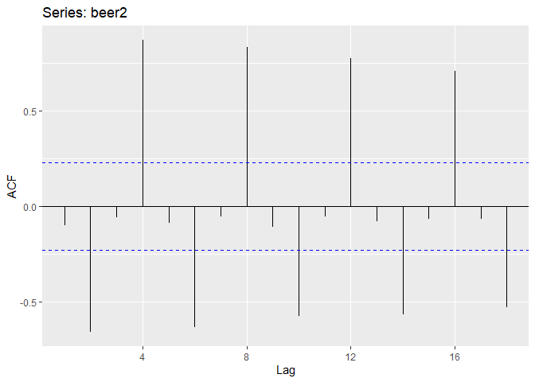<!-- -->

*r*<sub>4</sub> is higher than other lags

*r*<sub>2</sub> is more negative than other lags

The dashed blue lines indicate the point where the correlations are
significantly different from zero.

### Trend & Seasonality in ACF plots

When data have a trend, the autocorrelations for small lags tend to be
large and positive because observations nearby in time are also nearby
in size. So the ACF of trended time series tend to have positive values
that slowly decrease as the lags increase.

When data are seasonal, the autocorrelations will be larger for the
seasonal lags (at multiples of the seasonal frequency) than for other
lags.

When data are both trended and seasonal, you see a combination of these
effects.

### Analysis of Australian Electricity Demand

#### Plotting of Electricity demand

``` r
aelec <- window(elec, start=1980) 
autoplot(aelec) + xlab("Year") + ylab("GWh")
```

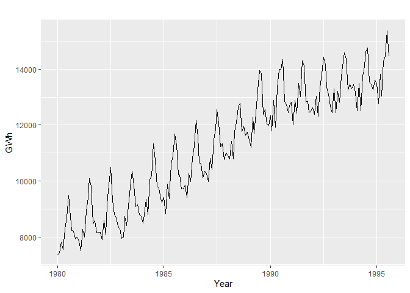<!-- -->

As we can observe from the graph a clear cut upward trend seasonal
pattern emerges. To explore further we perform autocorrelation

#### Autocorrelation graph:

``` r
ggAcf(aelec, lag.max = 48)
```

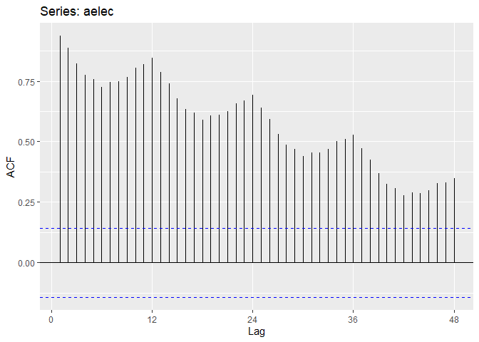<!-- -->

Important: The slow decrease in the ACF as the lags increase is due to
the trend, while the “scalloped” shape is due the seasonality.

## White Noise:

Time series having no autocorrelation signify white noise. It can be
seen as just a random fluctuation, without any interlinkage with the
past values.

``` r
set.seed(99) 
series <- ts(rnorm(100))

autoplot(series) + ggtitle("White noise")
```

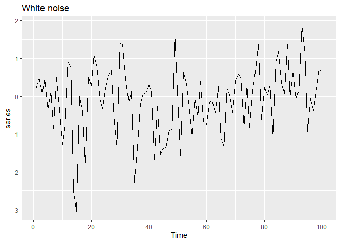<!-- -->

Let’s check the autocorrelation, by plotting the correlogram

``` r
ggAcf(series)
```

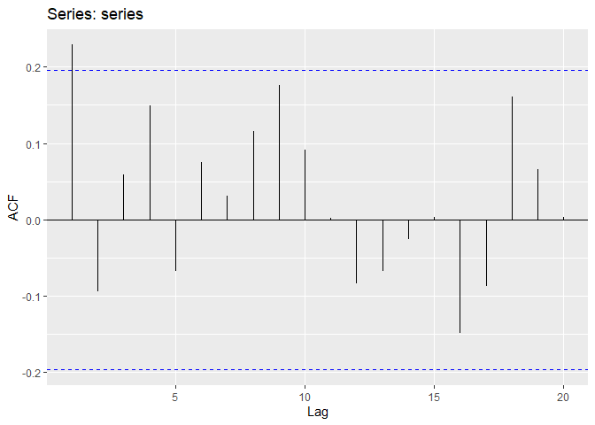<!-- -->

For white noise series, we expect each autocorrelation to be close to
zero. Of course, they will not be exactly equal to zero as there is some
random variation. For a white noise series, we expect 95% of the spikes
in the ACF to lie within

 ± 2/ $\\sqrt{T}$

where, T is the length of the time series.
